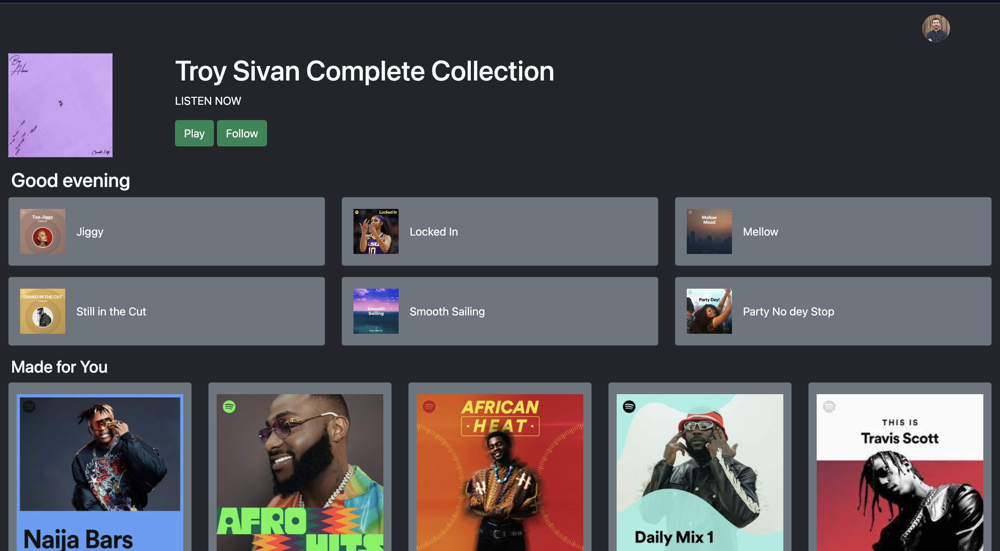

# Spotify-like Homepage

## Description

This project is a simple Spotify-like homepage created using Bootstrap, HTML, CSS, and JavaScript. It mimics the design and layout of the Spotify homepage, showcasing various UI components and responsiveness using Bootstrap's utility classes.

## Features

- Responsive design with Bootstrap.
- Navigation bar with a responsive collapsible menu.
- Hero section with a background image and call-to-action buttons.
- Featured playlists section with images and hover effects.

## How to Use

1. Clone the repository:

2. Open `index.html` in your web browser to view the homepage.

## Screenshots

## Built With

- HTML
- CSS
- JavaScript
- Bootstrap

